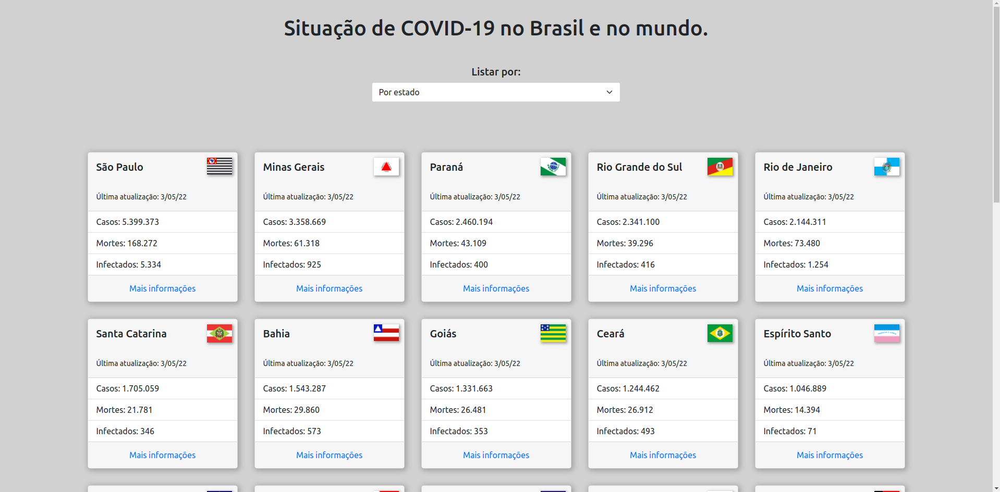

# Covid-App

#### Projeto Publicado: [Clique aqui](https://covid-cards.netlify.app)


Projeto que mostra em tempo real, dados do COVID-19 pelo Brasil e pelo mundo, atualizada diariamente.

API utilizada: <https://covid19-brazil-api.now.sh/api/>




## Para começar

#### 1- Clone o repositório

#### 2- Instale as dependencias

```
npm install
```

#### 1- Inicie o servidor de desenvolvimento

```
npm start ou ng serve
```

---

#### Tecnologias e ferramentas 📚

- [x] VS Code
- [x] Postman
- [x] GIT

- [x] Angular 12
- [x] Bootstrap
- [x] SASS
- [x] API REST

#### Conceitos aplicados 📚

- [x] Loops
- [x] Binds
- [x] Expressão regular
- [x] Consumo de API REST
- [x] Enums
- [x] Padrão BEM
- [x] Condicionais
- [x] Diretivas
- [x] Pipes
- [x] Flex box
- [x] Resposividade

---

 <small>Me chame no meu  [Linkedin](https://www.linkedin.com/in/wendell-rodrigues-30011997/) Vamos conversar!  👋🏻</small>

<small>Desenvolvido com ❤️ por Wendell Rodrigues</small>
